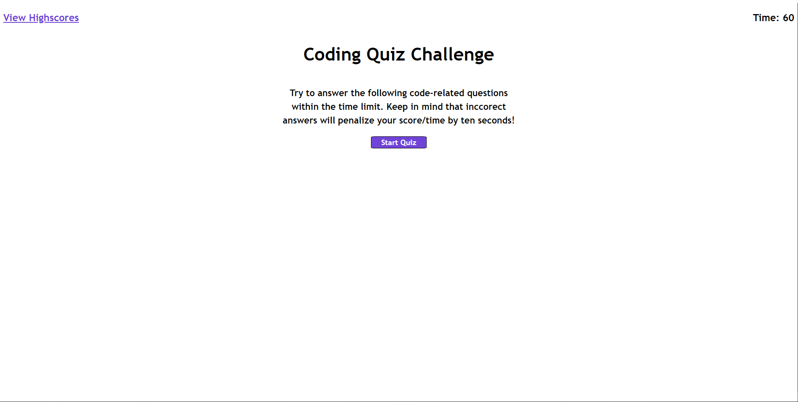

# Coding Quiz!

This is a general quiz of aspects of coding that we've learned so far.

## Description

This quiz implements a lot of JavaScript methods and functionality that we have learned and was a lot of fun to build!
It's just a few basic coding questions and it is timed! Highscores are tracked and stored.

### Installing

No installation required! Application runs on browser.

### Executing program

To start the quiz, simply click the "Start Quiz" button. Following that, you will be asked a series of coding questions.
You will be notified if you answered correctly or not after you select your answer. Your score is your time remaining after
the final question, but be careful not to go too fast! The timer will penalize you for wrong answers and reward you for correct
answers.

## Authors

Dylan Crowley:

[Github](https://github.com/dcrowdev)  
[Twitter](https://twitter.com/dcrowdev)  
[LinkedIn](https://www.linkedin.com/in/dylan-crowley-3974b8252/)  
dcrowdev1025@gmail.com

## License

This project currently has no license.

## Acknowledgments

Special thanks to one of my TA's, Seth Wooten for helping me with a local storage issue.